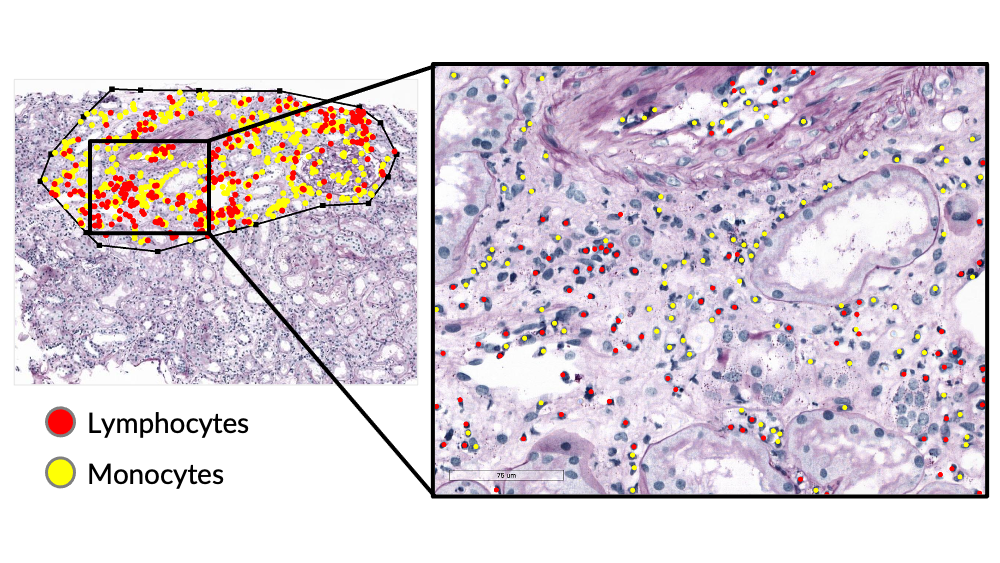
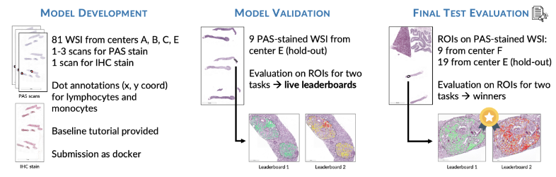

# UNIMORE AImageLab Zip MONKEY Challenge Solution

## Installation

To run the code in the simplest way, you need anaconda/conda installed.
Simply run the script `install_conda_env.sh`

    bash install_conda_env.sh

If you want to develop locally with VSCode you can use the .devcontainer files to make a docker with the exact os, libraries, etc..
See how in the [devcontainers VSCode documentation](https://code.visualstudio.com/docs/devcontainers/containers).

## Overview of the MONKEY Challenge: Detection of Inflammation in Kidney Biopsies

The MONKEY (Machine-learning for Optimal detection of iNflammatory cells in the KidnEY) challenge aims to develop automated methods for detecting and classifying inflammatory cells in kidney transplant biopsies. This initiative seeks to enhance the consistency and efficiency of histopathological assessments, particularly in the context of the Banff classification system.

> [!IMPORTANT]  
> Please read the [Monkey Challenge Website](https://monkey.grand-challenge.org/) and watch the [Official Seminar](https://www.youtube.com/watch?v=A1uZmbYutYU) on YouTube.
>
> For a medical background introduction, please read this doc: [pathology and background](docs/medical_background_pathology.md).

### Kick-off Webinar

### Challenge Overview

The challenge comprises two primary tasks:

1. **Detection of Mononuclear Inflammatory Cells (MNLs):** Identifying mononuclear leukocytes in biopsy images.
2. **Classification of Inflammatory Cells:** Distinguishing between monocytes and lymphocytes within the detected cells.

### Timeline

The challenge is structured into three phases:

1. **Debugging Phase (August–December 2024):** Participants develop and debug their Docker containers with access to debugging logs.
2. **Live Leaderboard Phase (August–November 2024):** Teams submit their models for evaluation on a validation set, with results displayed on a live leaderboard.
3. **Final Test Phase (December 2024):** Final submissions are evaluated on a test set to determine the winners.

An open submission cycle will follow, allowing ongoing participation and submissions for up to five years.

### Dataset

The dataset includes [PAS-stained WSI](#pas-stained-wsi) of kidneys, which is a common staining method for this tissue. Different types of scans are available for the same slide:

- **CGP scan**
- **Diagnostic Scan**
- **Original Scan**
- **IHC (Immunohistochemistry) scan**: Used as annotation reference.

Pathologists annotated on the IHC scans, marking the positions (x, y coordinates) of lymphocytes and monocytes within [ROIs (Regions of Interest)](#roi---region-of-interest-in-the-kidney-wsis).

#### Available Data

- Not every type of scan is available for every center.
- An Excel file provides detailed information.
- Annotations include immune cells' coordinates and ROI masks in TIFF files.

#### Dataset Details

The training set contains **81 cases**. For each case, the following information is available:

#### WSI Data

- **PAS slide scanned with "CPG profile"** using a P1000 WSI scanner (3DHistech) at Radboudumc.
- **PAS slide scanned with "diagnostic profile"** using a P1000 WSI scanner (3DHistech) at Radboudumc.
- **PAS slide scanned at the source institution** (available for Vienna and Mayo only).
- **IHC slide**: Double-stained for monocytes (PU.1 antibody, red) and lymphocytes (CD3/CD20 antibody, brown), used to guide the annotation process.

All slides are co-registered and available in TIFF format at a spacing of 0.24 µm/pixel.

#### Annotation Data

- **XML files** containing coordinates of annotations and ROI polygons.
- **JSON files** in the same format as the output.
- **Binary masks** of the ROIs in TIFF format.

#### Data Information

- annotations:
Dot annotations of the monocytes and lymphocytes (collectively inflammatory cells) in the grand-challenge json format as well as in xml format (which can be loaded in ASAP).

- images/tissue-masks:
Tissue masks for the region (polygon) of interests as a binary tif file.

- images/pas-cpg:
Scanned tif of the PAS WSI using the CPG scanning profile at Radboud. The annotations are made on these files, and all other tif images are registered to them.

- images/pas-diagnostic:
Scanned tif of the PAS WSI using the Diagnostic scanning profile at Radboud.

- images/pas-original:
Tif of the PAS WSI scanned at the center of origin.

- images/ihc:
Will be uploaded asap. Contains the IHC double stains for the monocytes (red) and lymphocytes (brown).

- context-information.xlsx:
Overview of the data quality, naming, diagnosis and other information (see sheet "explanations").

#### Folder structure

    ├── ReadMe.txt
    ├── annotations/
    │   ├── json/
    │   │   ├── A_P000001_inflammatory-cells.json
    │   │   ├── A_P000001_monocytes.json
    │   │   ├── A_P000001_lymphocytes.json
    │   │   ├── A_P000002_inflammatory-cells.json
    │   │   └── (...).json
    │   └── xml/
    │       ├── A_P000001.xml
    │       ├── A_P000002.xml
    │       └── (...).xml
    ├── images/
    │   ├── tissue-masks/
    │   │   ├── A_P000001_tissue-mask.tif
    │   │   ├── A_P000002_tissue-mask.tif
    │   │   └── (...).tif
    │   ├── pas-cpg/
    │   │   ├── A_P000001_PAS_CPG.tif
    │   │   ├── A_P000001_PAS_CPG.tif
    │   │   └── (...).tif
    │   ├── pas-diagnostic/
    │   │   ├── A_P000001_PAS_Diagnostic.tif
    │   │   ├── A_P000001_PAS_Diagnostic.tif
    │   │   └── (...).tif
    │   ├── pas-original/
    │   │   ├── A_P000001_PAS_Original.tif
    │   │   ├── A_P000001_PAS_Original.tif
    │   │   └── (...).tif
    │   └── ihc/
    │       ├── A_P000001_IHC_CPG.tif
    │       ├── A_P000001_IHC_CPG.tif
    │       └── (...).tif
    └── metadata/
        └── context-information.xlsx

### Submission

Participants must submit Docker containers encapsulating their algorithms. Submissions are evaluated using Free Response Operating Characteristic (FROC) analysis, focusing on sensitivity at predefined false positive rates.

### Evaluation & Ranking

The primary evaluation metric is the FROC score, calculated by assessing sensitivity at specific false positive rates per square millimeter. Separate FROC scores are computed for:

- Overall inflammation cell detection (MNLs).
- Individual detection of monocytes and lymphocytes.

Detailed evaluation scripts are available on the challenge's GitHub repository.

## Rules

### Participation

- All participants must form [teams](https://monkey.grand-challenge.org/teams/), even if composed of a single participant.
- Each participant can only be a member of one team.
- Anonymous participation is not allowed. Participants must have verified Grand Challenge profiles with accurate names and affiliations.
- Members of sponsoring or organizing centers may participate in the challenge.
- Only fully automated methods in Docker containers are supported. Semi-automated or interactive methods are not allowed.
- All Docker containers submitted will be run in an offline setting (no internet access). All necessary resources must be included beforehand.
- Participants and their AI algorithms must adhere to compute limits. Participants are responsible for ensuring their algorithm runtime fits within these limits.
- Organizers reserve the right to disqualify any participant or team for unfair or dishonest practices.
- Participants can withdraw from the challenge but cannot retract prior submissions or published results.

### Training Data, Models, and Code

- **External data and pre-trained models** are allowed if they are freely and publicly available under a permissive open-source license.
- The use of external data must be clearly stated in the submission, algorithm name, algorithm page, and/or supporting publication/URL.
- The participating team's code (for training and inference) and model weights must be available on GitHub (or similar) with a permissive open-source license.

### Publication

- Up to three members of each leaderboard's top three performing teams will be invited to participate in the challenge paper as consortium authors.
- Participants are encouraged to submit their solution as a short paper at MIDL 2025.
- Participants and non-participating researchers using the dataset can publish their results separately at any time.
- All submitted algorithms will be publicly available as Grand Challenge Algorithms.
- Any publication using this dataset must cite the [Structured Challenge Report](https://zenodo.org/records/13794656).

### References

For more detailed information, visit the [MONKEY challenge website](https://monkey.grand-challenge.org/).

## How To: Tutorial and Baseline

### Grand Challenge Workflow

Participants develop their algorithms, which are run in Docker containers on Grand Challenge. The evaluation is performed on the outputs produced, and FROC scores are obtained.

### Code Tutorial on GitHub

The baseline algorithm and tutorials are available on [GitHub](https://github.com/computationalpathologygroup/monkey-challenge).

The provided notebooks include:

1. **Data Preparation**
2. **Batch Iterator and Training**
3. **Inference Using Mask**

Participants need to wrap their code into a Docker container for submission to Grand Challenge.

### Docker Submission Steps

- **test_run.sh**: Test locally on a Docker container to debug.
- **save.sh**: Generate the ZIP file of the Docker container for upload.
- **Algorithm Creation on Grand Challenge**: Define INPUT and OUTPUT for the algorithm.
- **Container Upload**: Upload the Docker ZIP file and model ZIP (tar.gz) to Grand Challenge.
- **Submission**: Select the algorithm in the submission section and submit.

**Note**: For the live leaderboard, there are no logs available, only the final output.

## Metrics and Model Validartion

### Validation Data

- **9 PAS-stained WSIs** with CGP scans from Center E are used for evaluation on ROIs only.
- The official metric is the **Free-Response ROC (FROC) curve**.
- The score is computed as the **average of the FROC score** at five pre-selected FP/mm² scales: `10, 20, 50, 100, 200, 300`.

> [!WARNING]  
> Only the PAS WSI scanned with the CPG profile will be used during the validation and test phase.

### FROC score

The FROC (Free-Response ROC) curve plots the true positive rate (TPR) on the y-axis against the average number of false positives (FP) per mm² on the x-axis. It is an alternative to the ROC curve, where the x-axis plots the false positive rate.

The score is computed as the average of the TPR at predefined FP/mm² scales.

The official metric for the challenge is the average FROC score at FP/mm² scales of `10, 20, 50, 100, 200, 300`.
