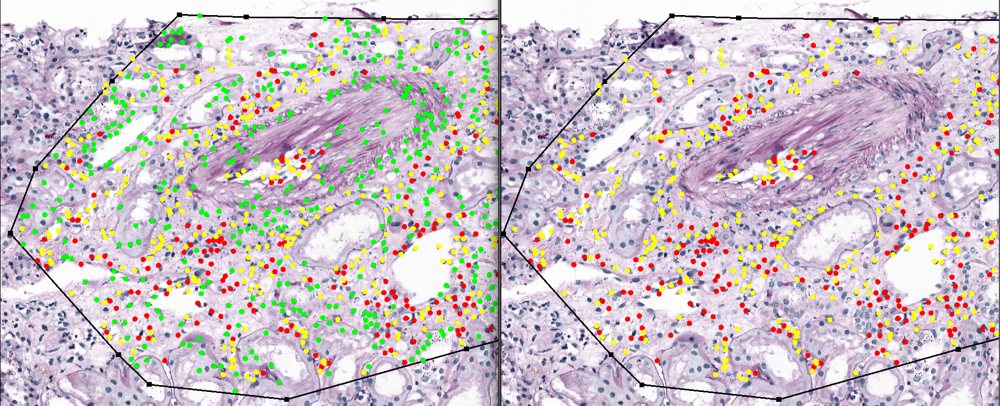

# UNIMORE AImageLab Zip MONKEY Challenge Solution

## Overview of the MONKEY Challenge: Detection of Inflammation in Kidney Biopsies

The MONKEY (Machine-learning for Optimal detection of iNflammatory cells in the KidnEY) challenge aims to develop automated methods for detecting and classifying inflammatory cells in kidney transplant biopsies. This initiative seeks to enhance the consistency and efficiency of histopathological assessments, particularly in the context of the Banff classification system.

> [!IMPORTANT]  
> Please read the [Monkey Challenge Website](https://monkey.grand-challenge.org/) and watch the [Official Seminar](https://www.youtube.com/watch?v=A1uZmbYutYU) on YouTube.
>
> For a medical background introduction, please read this doc: [pathology and background](docs/medical_background_pathology.md).

### Kick-off Webinar

### Challenge Overview

The challenge comprises two primary tasks:

1. **Detection of Mononuclear Inflammatory Cells (MNLs):** Identifying mononuclear leukocytes in biopsy images.
2. **Classification of Inflammatory Cells:** Distinguishing between monocytes and lymphocytes within the detected cells.

# **Architecture and Inference Pipeline**

> [!NOTE]  
> We are currently writing the documentation for this repository as it is not yet complete. 
> Thank you for your patience.
>

Our approach is based on the state-of-the-art **[CellViT-plus-plus](https://github.com/TIO-IKIM/CellViT-plus-plus)** framework, which leverages a pre-trained foundational model backbone for **nuclei detection, segmentation, and classification** in whole slide images (WSIs). We enhance the system by fine-tuning a **multi-layer perceptron (MLP) classifier** to assign one of three classes to every detected nucleus: **monocytes, lymphocytes, and an additional "other" class**. The "other" class is generated semi-automatically using the **CellViT SAM-H model**, augmenting the training dataset for the **MONKEY challenge**.

---

## **Detection and Classification Workflow**

### **1. WSI Patchification**
- We create a **custom patchified dataset** from the input WSI using the **Whole Slide Data** library.
- The patches and their associated **region-of-interest (ROI) masks** are stored in a temporary folder.
- This step ensures efficient processing of extremely large WSIs.

### **2. Nuclei Detection and Embedding Extraction**
- The **pre-trained CellViT-plus-plus backbone** is used to **detect nuclei** in the patches.
- The model also extracts high-quality **feature embeddings** for each detected nucleus.

### **3. MLP Classifier Fine-tuning**
- A **multi-layer perceptron (MLP) classifier** is fine-tuned on a custom dataset composed of **extracted nuclei embeddings**.
- Since the foundational model detects all nuclei, we generate a **third annotated class ("other")** using **CellViT SAM-H**.
- This additional class improves classifier robustness on the **MONKEY challenge dataset**.

---

## **Inference with Ensemble or Single Model**
At inference time, we support **two modes**:

### **1. Ensemble Inference**
- Each of the **5-fold models** runs independently on the **patchified dataset**.
- **Global cell prediction dictionaries** from each model are merged using a **KDTree-based clustering strategy**.
- Within each cluster:
  - **Majority voting** determines the final predicted class.
  - **Averaged probabilities** (only from agreeing predictions) reduce variance.

### **2. Single Model Inference**
- If only one model is provided, the pipeline runs **without ensemble merging**.

## **Postprocessing**

### **1. ROI Filtering**
- Only **predictions inside the tissue region** (defined by the WSI mask) are retained.

### **2. Overlapping Detections**
- **KDTree-based deduplication** removes overlapping predictions within a **specified radius**.

### **3. Coordinate Conversion**
- Using the **base microns-per-pixel (MPP) resolution**, final **pixel coordinates** are converted to **millimeters**.

## **Annotation Generation**
- The final, filtered detections are parsed into **three JSON files**, corresponding to the three required classes.
- These JSON files serve as the **final output for evaluation**.

### Example of semi-automatic Annotation using the CellVit SAM-H backbone

## Licensing Information

This project incorporates multiple software components, each governed by specific licenses:

### **VIT256 License**
- **License:** Apache 2.0 with Commons Clause
- **Licensor:** Mahmood Lab
- **Restriction:** Commercial use prohibited under the **Commons Clause**.

### **SAM License**
- **License:** Apache 2.0
- **Permissions:** Commercial use, modifications, distribution, and patent use allowed.
- **Conditions:** Includes copyright and documentation of changes.

### **CellViT++ License**
- **License:** Apache 2.0 with Commons Clause
- **Licensor:** Fabian Hörst, Jens Kleesiek
- **Restriction:** Commercial use prohibited under the **Commons Clause**.
- **Citation Requirement:** If using this software, cite the following works:
  - Hörst, F., et al. (2024). *CellViT: Vision Transformers for precise cell segmentation and classification*. Medical Image Analysis, 94, 103143. [DOI:10.1016/j.media.2024.103143](https://doi.org/10.1016/j.media.2024.103143)
  - Hörst, F., et al. (2025). *CellViT++: Energy-Efficient and Adaptive Cell Segmentation and Classification Using Foundation Models*. arXiv. [DOI:10.48550/ARXIV.2501.05269](https://doi.org/10.48550/ARXIV.2501.05269)
