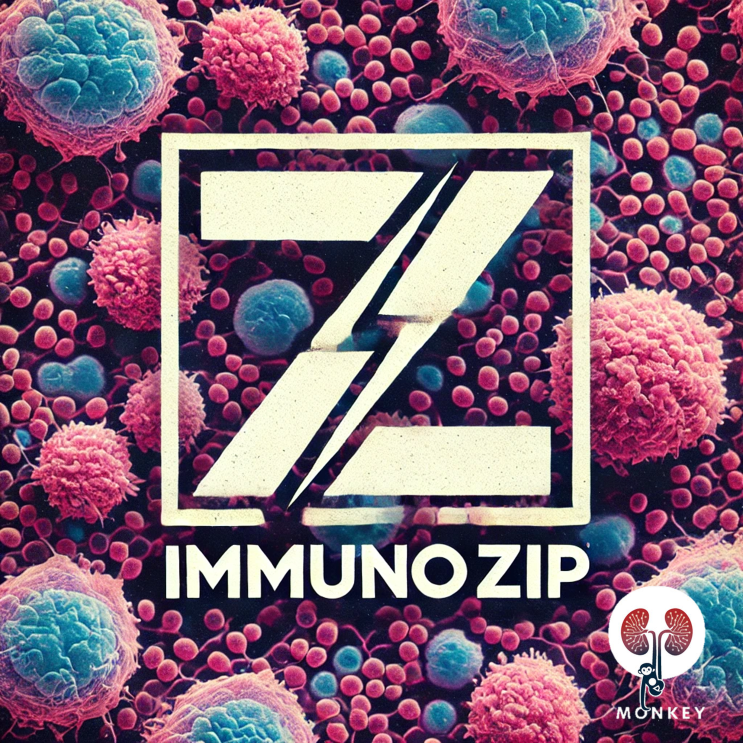
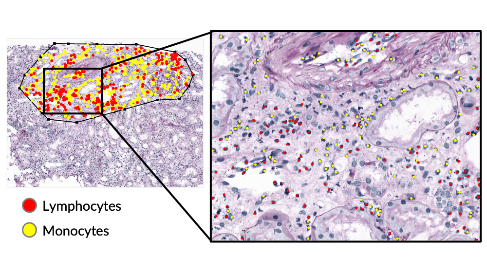
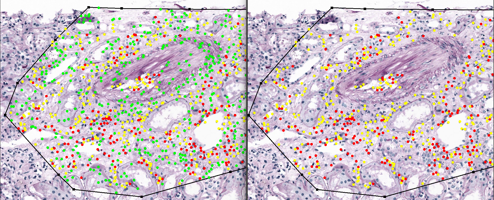

# UNIMORE AImageLab Zip MONKEY Challenge Solution - ImmunoZip

## Overview of the MONKEY Challenge: Detection of Inflammation in Kidney Biopsies

The MONKEY (Machine-learning for Optimal detection of iNflammatory cells in the KidnEY) challenge aims to develop automated methods for detecting and classifying inflammatory cells in kidney transplant biopsies. This initiative seeks to enhance the consistency and efficiency of histopathological assessments, particularly in the context of the Banff classification system.

> [!IMPORTANT]  
> Please read the [Monkey Challenge Website](https://monkey.grand-challenge.org/) and watch the [Official Seminar](https://www.youtube.com/watch?v=A1uZmbYutYU) on YouTube.
>
> For a medical background introduction, please read this doc: [pathology and background](docs/medical_background_pathology.md).

### Kick-off Webinar

### Challenge Overview

The challenge comprises two primary tasks:

1. **Detection of Mononuclear Inflammatory Cells (MNLs):** Identifying mononuclear leukocytes in biopsy images.
2. **Classification of Inflammatory Cells:** Distinguishing between monocytes and lymphocytes within the detected cells.

# Installation & Inference

## ⚠️ Important

**To test inference with our pretrained models, included in this repo, we highly suggest you use docker**. In this way you will create a docker container as in the challenge that will be tested with a **single** input WSI `.tif` file and the corresponding tissue mask `.tif` file.

## System Requirements

**We recommend a machine using UNIX/LINUX with at least 32 GB of RAM, an NVIDIA CUDA compatible GPU with 16 GB minimum and 60 GB or more of free disk space.**

We installed CUDA 12.1, and used both an HPC clusters with various NVIDIA GPUS ranging from 16 to 48 GB and a local machine with [Docker](https://www.docker.com/) and the [NVIDIA Container Toolkit](https://docs.nvidia.com/datacenter/cloud-native/container-toolkit/latest/install-guide.html) for testing the challenge container.

The docker algorithm ran without issues in the [Grand Challenge](https://monkey.grand-challenge.org/) platform, using the `ml.g4dn.xlarge` istance that comprises a single NVIDIA T4 GPU, 4 vCPUs, 16GiB of Memory and 125 GB NVMe SSD.

## Steps

1. Download the backbone model weights (VIT-256 & SAM-H) from the [CellViT-plus-plus](https://github.com/TIO-IKIM/CellViT-plus-plus) repository [here](https://drive.google.com/drive/folders/1ujtMcxAr5kYYuvnbglfYZZnRH3ZOli79).

2. Put the CellVit++ backbones weights in the respective folders:

    - `CellViT-SAM-H-x40-AMP.pth` goes in the `docker_inference_grand_challenge/resources/backbones/SAM-H` folder.
    - `CellViT-256-x40-AMP.pth` goes in the `docker_inference_grand_challenge/resources/backbones/VIT-256` folder. 
    
3. The finetuned weights (ensemble) are already in the repository folder in `docker_inference_grand_challenge/example_model`, while other additional fallback model weights or the one used before the ensemble submission are in the `docker_inference_grand_challenge/resources/models` folder.

4. Put your WSI `.tif` image in the `docker_inference_grand_challenge/test/input/images/kidney-transplant-biopsy-wsi-pas` folder and the WSI tissue-mask `.tif` file in the `docker_inference_grand_challenge/test/input/images/tissue-mask` folder.

### Option A - Inference with docker (recommended)

5. Run the `test_run.sh` in the `docker_inference_grand_challenge` folder. The script will create a docker container installing all the required dependencies, then run the inference via the entrypoint `inference.py` script.

6. If successful, 3 JSONs files for the predictions will be in the `docker_inference_grand_challenge/test/output` folder.

7. (OPTIONAL) If the inference was successfull, you can use the `save.sh` script to save the compressed container for uploading it in the Grand Challenge website. You can then compress the models inside the `docker_inference_grand_challenge/example_model` folder also for uploading them separately in the Grand Challenge platform. You can do that by running:

         tar -czvf ensemble_compressed_models.tar.gz -C /docker_inference_grand_challenge/example_model/ .

### Option B - Inference using Conda env (less reproducible)

5. Install the conda env and other requirements:

        conda env create -f environment_verbose.yaml
        conda activate cellvit_env
        pip install -r requirements.txt

6. Re-install a correct/different version of torch, torchvision and torchaudio depending on your CUDA version (we used CUDA 12.1 as the original CellVit++ repo)

        pip install torch==2.2.2 torchvision==0.17.2 torchaudio==2.2.2 --index-url https://download.pytorch.org/whl/cu121

7. Install [ASAP](https://github.com/computationalpathologygroup/ASAP)
8. Install [Openslide](https://github.com/openslide/openslide-python) and [WholeSlideData](https://github.com/DIAGNijmegen/pathology-whole-slide-data):

        pip install openslide-python openslide-bin
        pip install git+https://github.com/DIAGNijmegen/pathology-whole-slide-data@main

9. Substitute the `path_to_ASAP_installation` with the actual ASAP path and `path_to_conda_env` with the path to your cellvit_env and run the command:

        echo "path_to_ASAP_installation/ASAP/bin" > path_to_conda_env/lib/python3.10/site-packages/asap.pth

10. In the `docker_inference_grand_challenge/inference.py` script, set the flag in line 226 to `False`:

        DOCKER_INFERENCE = False # NOTE: Set to False if running locally without Docker

11. Run the `docker_inference_grand_challenge/inference.py` script

12. If successful, 3 JSONs files for the predictions will be in the `docker_inference_grand_challenge/test_output` folder.

# **Architecture and Inference Pipeline**

> [!NOTE]  
> We are currently writing the documentation for this repository as it is not yet complete. 
> Thank you for your patience.
>

Our approach is based on the state-of-the-art **[CellViT-plus-plus](https://github.com/TIO-IKIM/CellViT-plus-plus)** framework, which leverages a pre-trained foundational model backbone for **nuclei detection, segmentation, and classification** in whole slide images (WSIs). We enhance the system by fine-tuning a **multi-layer perceptron (MLP) classifier** to assign one of three classes to every detected nucleus: **monocytes, lymphocytes, and an additional "other" class**. The "other" class is generated semi-automatically using the **CellViT SAM-H model**, augmenting the training dataset for the **MONKEY challenge**.

---

## **Detection and Classification Workflow**

### **1. WSI Patchification**
- We create a **custom patchified dataset** from the input WSI using the **Whole Slide Data** library.
- The patches and their associated **region-of-interest (ROI) masks** are stored in a temporary folder.
- This step ensures efficient processing of extremely large WSIs.

### **2. Nuclei Detection and Embedding Extraction**
- The **pre-trained CellViT-plus-plus backbone** is used to **detect nuclei** in the patches.
- The model also extracts high-quality **feature embeddings** for each detected nucleus.

### **3. MLP Classifier Fine-tuning**
- A **multi-layer perceptron (MLP) classifier** is fine-tuned on a custom dataset composed of **extracted nuclei embeddings**.
- Since the foundational model detects all nuclei, we generate a **third annotated class ("other")** using **CellViT SAM-H**.
- This additional class improves classifier robustness on the **MONKEY challenge dataset**.

---

## **Inference with Ensemble or Single Model**
At inference time, we support **two modes**:

### **1. Ensemble Inference**
- Each of the **5-fold models** runs independently on the **patchified dataset**.
- **Global cell prediction dictionaries** from each model are merged using a **KDTree-based clustering strategy**.
- Within each cluster:
  - **Majority voting** determines the final predicted class.
  - **Averaged probabilities** (only from agreeing predictions) reduce variance.

### **2. Single Model Inference**
- If only one model is provided, the pipeline runs **without ensemble merging**.

## **Postprocessing**

### **1. ROI Filtering**
- Only **predictions inside the tissue region** (defined by the WSI mask) are retained.

### **2. Overlapping Detections**
- **KDTree-based deduplication** removes overlapping predictions within a **specified radius**.

### **3. Coordinate Conversion**
- Using the **base microns-per-pixel (MPP) resolution**, final **pixel coordinates** are converted to **millimeters**.

## **Annotation Generation**
- The final, filtered detections are parsed into **three JSON files**, corresponding to the three required classes.
- These JSON files serve as the **final output for evaluation**.

### Example of semi-automatic Annotation using the CellVit SAM-H backbone

## Acknowledgments and Citations

This repository makes use of multiple frameworks and models developed by external research teams. We acknowledge their contributions and provide citations for the works that influenced this project.

### **Referenced Works**

- **CellViT & CellViT++**
  - Hörst, F., et al. (2024). *CellViT: Vision Transformers for precise cell segmentation and classification*. Medical Image Analysis, 94, 103143.  
    [DOI:10.1016/j.media.2024.103143](https://doi.org/10.1016/j.media.2024.103143)
  - Hörst, F., et al. (2025). *CellViT++: Energy-Efficient and Adaptive Cell Segmentation and Classification Using Foundation Models*. arXiv.  
    [DOI:10.48550/ARXIV.2501.05269](https://doi.org/10.48550/ARXIV.2501.05269)

- **VIT256 & HIPT**
  - Mahmood Lab. *HIPT: Hierarchical Image Pyramid Transformer for Histopathology*.  
    Licensed under **Apache 2.0 with Commons Clause**.  
    [Source Repository](https://github.com/mahmoodlab/HIPT)

- **Segment Anything Model (SAM)**
  - Kirillov, A., et al. (2023). *Segment Anything*. Meta AI Research.  
    Licensed under **Apache 2.0**.  
    [Source Repository](https://github.com/facebookresearch/segment-anything)

These works have significantly contributed to the development of our approach in the MONKEY Challenge. If you use this repository, please ensure proper attribution to these sources.

