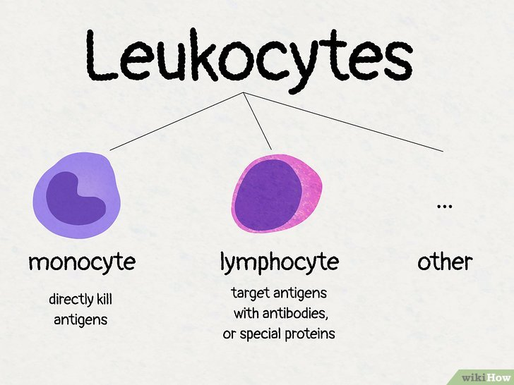

# MONKEY Challenge - Pathology and Background

## Medical Motivation for the MONKEY Challenge

When a kidney transplant rejection is suspected, a biopsy is performed. Pathologists analyze the tissue to determine if it is normal or abnormal. If abnormal, they:

- Estimate if the damage is acute or chronic.
- Assess the severity and degree of tissue scarring.
- Predict the future course and estimate the cause or diagnosis.

Since this process is time-consuming, pathologists need AI tools to automatically detect inflammatory cells.

## Banff Lesion Scores

Pathologists use the **Banff Lesion Scores (BLS)** to assess the state of the kidney after a transplant.

- **8 out of 17 items** in BLS are about inflammation.
- The method results in a category score from 1 to 6.
- Due to the time-consuming nature, there's a need for AI assistance.

## Kidney Overview

### Function of the Kidneys

- **Filtration**: Removes waste and extra fluid from blood.
- **Reabsorption**: Reabsorbs useful substances back into the blood.
- **Excretion**: Eliminates waste as urine.
- **Regulation**: Maintains electrolyte balance, regulates blood pressure, balances pH levels.

### Kidney Composition

- **Cortex (Outer Part)**: Contains most of the filtering units called nephrons.
- **Medulla (Inner Part)**: Contains structures like loops of Henle and collecting ducts.

- **Main Units**:
  - **Nephron**: The basic filtering unit of the kidney.
    - **Glomerulus**: Tiny network of blood vessels where filtration starts.
    - **Tubules**: Process the filtered fluid to make urine.

  

### 3. Key Interest Points in Pathology

- **Glomerular Issues**: Damage or inflammation of glomeruli.
- **Tubulointerstitial Issues**: Diseases in tubules and surrounding tissue.
- **Vascular Issues**: Blood supply problems leading to tissue damage.
- **Structural Changes**: Tumors, cysts, or abnormal growths.

## Immune Cells in the Kidney

### Types of Inflammatory Cells

- **Mononuclear Cells**:
  - **Monocytes**: Precursors to macrophages, clear debris and attack pathogens.
  - **Lymphocytes**: Key players in adaptive immunity.
- **Neutrophils**: First responders during acute inflammation.
- **Eosinophils**: Seen in allergic reactions or parasitic infections.
- **Macrophages**: Engulf and digest cellular debris and pathogens.
- **Plasma Cells**: Produce antibodies.
- **Mast Cells**: Release histamine during allergic responses.

### Mononuclear Cells in the Kidney

#### 1. Monocytes

- Circulate in blood and become macrophages in tissues.
- Clear debris, pathogens, and damaged cells.
- Presence indicates ongoing immune activity or tissue damage.

#### 2. Lymphocytes

- **T-Lymphocytes (T-cells)**:
  - Cytotoxic T-cells: Attack infected or abnormal cells.
  - Helper T-cells: Regulate activity of other immune cells.
- **B-Lymphocytes**:
  - Produce antibodies.
- Presence often suggests an ongoing immune response.

### Mononuclear Cells in Tubulitis

- In tubulitis, lymphocytes are the most common infiltrating immune cells, though monocytes can also be present.
- Presence around or within kidney tubules is a sign of immune activity, often in:
  - Transplant rejection
  - Autoimmune diseases
  - Viral infections affecting the kidney

## Inflammation in Kidney Transplant Biopsies

According to the [Banff Classification](https://banfffoundation.org/central-repository-for-banff-classification-resources-3/), ten out of the 17 Banff Lesion Scores (BLS) focus on the presence and extent of inflammatory cells in different kidney compartments.

- **Leukocytes** include polymorphonuclear cells (neutrophils, eosinophils, basophils) and mononuclear cells (lymphocytes and monocytes).
- **For simplicity, the MONKEY challenge focuses on mononuclear cells (monocytes and lymphocytes)**.

## Morphology

Pathologists differentiate inflammatory cells based on morphological characteristics.

- **Monocytes**:
  - Largest cell type in blood (15–22 µm).
  - Ellipsoidal nucleus, often lobulated or dented (bean-shaped).
  - Pale chromatin, moderate to abundant cytoplasm.
- **Lymphocytes**:
  - Smaller cells (~7 µm).
  - Rounded, dark/dense nucleus.
  - Scant cytoplasm.

## Immunohistochemistry (IHC)

IHC is used to differentiate between cell types when morphology alone is insufficient.

- **Lymphocytes**:
  - **Markers**: CD3 and CD20.
  - **Staining Result**: Dark brown cytoplasmic staining.
- **Monocytes**:
  - **Marker**: PU.1.
  - **Staining Result**: Magenta nuclear staining.

### Considerations

- **Staining Quality**: The effectiveness of IHC depends on the staining quality.
- **Integration with PAS-Stained Slides**: Combining PAS with IHC enhances analysis by providing structural context and precise cell identification.

---

[Back to Top](#)
